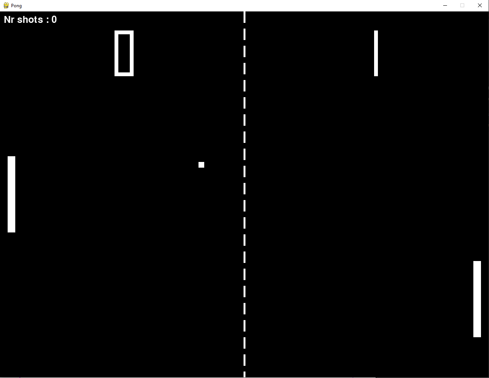

# pong
A simple game of pong, programmed in Python, using the library pygame, trying to recreate the look and feel of the orginial arcade Pong game in 1972.

Two-player game, left player will use the keyboard, right player the mouse.

This is only a quick test to try the possibilities of Pygame library, it really needs to be improved :)

Here is a screenshot of the game :

